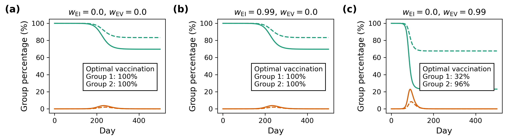
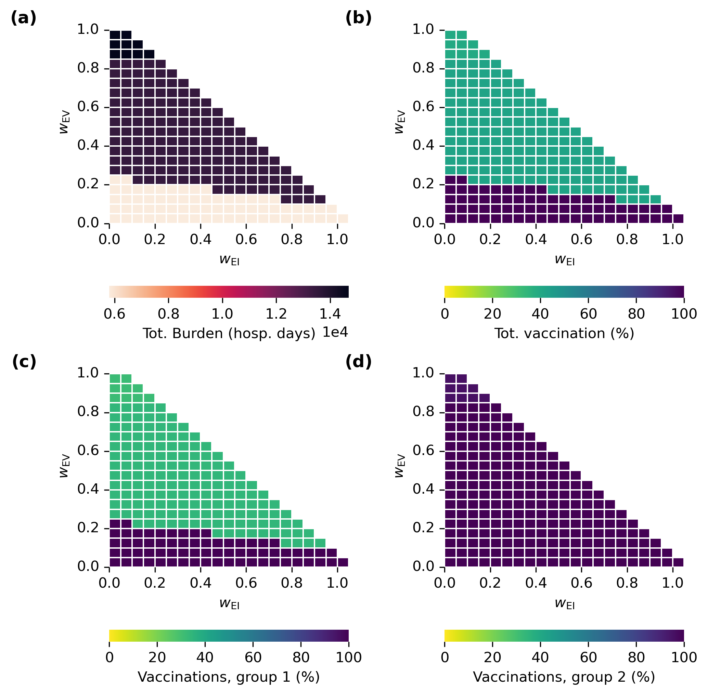

# Ethical Framework

## Usage

### Environment

```
conda env create -f environment.yaml
```

### Snakemake pipeline

There is a `snakefile` to configure building the grid-search database
and to generate some basic plots. To run the whole pipeline on a
single core use the following command:

```
snakemake -c1 -p
```

To do a dry-run to see what snakemake would do, add `-n`:

```
snakemake -c1 -pn
```

### Housekeeping

To lint the code and keep documentation up to date:

```
$ bash housekeeping.sh
```

## Gallery of results figures

Here are some figures for one particular configuration file. This
[script](./plot_trajectories_and_loss_surfaces.py) generates the
following two example plots.




This [script](./plot-ab-heatmaps-vaccination-and-clinical-burden.py)
generates heatmaps of the clinical burden when using the optimal
vaccination strategy for a range of different ethical framework
configurations. The plot the script produces is below.



## Configuration

To avoid magic numbers appearing thoughout the code, there is a single
file `config/config-YYY-MM-DD.json` which should be used as the single
source of truth regarding parameter values. If you want to change one
of the parameters, it should simply be a matter of adjusting this
file.

Consult the [FAQs](#faqs) if you want to modify this configuration.
There might be helpful information in there.

## Database

We use a database of simulations to avoid needing to recompute them
for subsequent analysis. This script would create a database
containing the model simulation results. We aren't using a database,
but it might be helpful to have this here as a model for how the data
is stored.

```sql
CREATE TABLE model_parameters (
id INTEGER PRIMARY KEY,
parameter1 REAL,
parameter2 REAL
);

CREATE TABLE initial_condition (
id INTEGER PRIMARY KEY,
condition1 REAL,
condition2 REAL
);

CREATE TABLE configuration (
id INTEGER PRIMARY KEY,
model_parameters_id INTEGER,
initial_condition_id INTEGER,
);

CREATE TABLE outcome (
id INTEGER PRIMARY KEY,
configuration_id INTEGER,
seed INTEGER,
outcome1 REAL,
outcome2 REAL
);

CREATE TABLE burden_parameters (
id INTEGER PRIMARY KEY,
parameter1 REAL,
parameter2 REAL
);
```


Note that we have split the `outcome` and the `configuration` table
because when using a stochastic model the outcomes are random
variables and this allows us to reference a shared configuration
rather than replicating that data in each outcome. It adds a bit of
complexity for the deterministic model case but should simplify things
in the stochastic case.

### Optimisation

The optimisation function takes an identifier for model and burden
parameters, and the database. It returns the identifier of the optimal
initial condition.

```python
def optimal_initial_condition(model_param_id: int,
                              burden_param_id: int,
                              db: dict) -> int:
```

## FAQs

#### How do I run the code in this repo?

1. Make sure you a bunch of standard scientific python packages
   installed.
2. (Optionally) remove any lingering output with `rm -r out`.
3. Run `snakemake -c1 -p` (or `-c[n]` if you want to run across `n`
   processes).
4. If this doesn't work, lodge an issue on GitHub.

#### How do I make things run quicker during development?

The simplest solution is probably to reduce the `"grid_step"` value in
the configuration file. But you could also reduce the population sizes
as well if you want to to run much quicker.

#### How do I change the resolution of levels of vaccination?

In the `grid_search_step` section of the configuration file, the
`grid_step` value is the size of the steps taken. If you make this a
smaller value, the resolution will improve but computations will take
longer.

#### What are these weird errors about `numpy._core`?

The pipeline is picky about always using the same version of numpy. If
you are getting an error about `numpy._core` you will need to
regenerate your pickle files. This won't take long, the easiest way is
to just remove everything from `out/` and start again.
